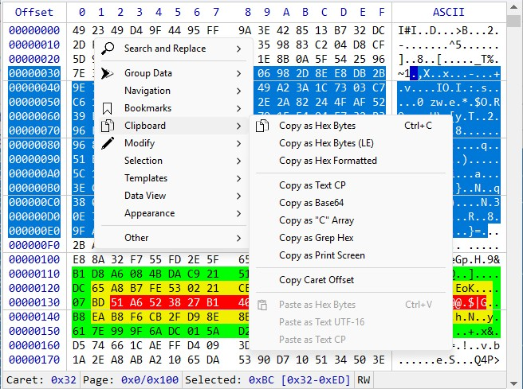
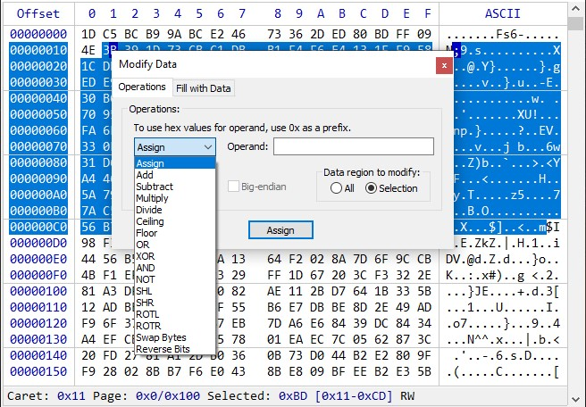
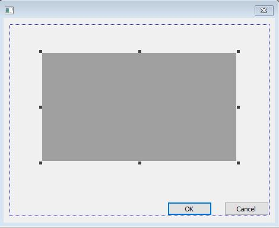
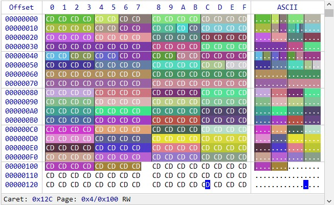

## **Hex Control**

## Table of Contents
* [Introduction](#introduction)
* [How To Build](#how-to-build)
  * [Integrate Sources](#integrate-sources)
  * [Dynamic Link Library](#dynamic-link-library)
* [Creating](#creating)
  * [Classic Approach](#classic-approach)
  * [In Dialog](#in-dialog)
  * [CreateHexCtrl](#createhexctrl)
* [Setting Data](#setting-data)
* [Virtual Data Mode](#virtual-data-mode)
* [Virtual Bookmarks](#virtual-bookmarks)
* [Custom Colors](#custom-colors)
* [Templates](#templates)
* [Methods](#methods) <details><summary>_Expand_</summary>
  * [ClearData](#cleardata)
  * [Create](#create)
  * [CreateDialogCtrl](#createdialogctrl)
  * [Delete](#delete)
  * [DestroyWindow](#destroywindow)
  * [ExecuteCmd](#executecmd)
  * [GetActualWidth](#getactualwidth)
  * [GetBookmarks](#getbookmarks)
  * [GetCacheSize](#getcachesize)
  * [GetCapacity](#getcapacity)
  * [GetCaretPos](#getcaretpos)
  * [GetCharsExtraSpace](#getcharsextraspace)
  * [GetCodepage](#getcodepage)
  * [GetColors](#getcolors)
  * [GetData](#getdata)
  * [GetDataSize](#getdatasize)
  * [GetDateInfo](#getdateinfo)
  * [GetDlgItemHandle](#getdlgitemhandle)
  * [GetFont](#getfont)
  * [GetGroupSize](#getgroupsize)
  * [GetMenuHandle](#getmenuhandle)
  * [GetOffset](#getoffset)
  * [GetPagesCount](#getpagescount)
  * [GetPagePos](#getpagepos)
  * [GetPageSize](#getpagesize)
  * [GetScrollRatio](#getscrollratio)
  * [GetSelection](#getselection)
  * [GetTemplates](#gettemplates)
  * [GetUnprintableChar](#getunprintablechar)
  * [GetWndHandle](#getwndhandle)
  * [GoToOffset](#gotooffset)
  * [HasInfoBar](#hasinfobar)
  * [HasSelection](#hasselection)
  * [HitTest](#hittest)
  * [IsCmdAvail](#iscmdavail)
  * [IsCreated](#iscreated)
  * [IsDataSet](#isdataset)
  * [IsHexCharsUpper](#ishexcharsupper)
  * [IsMutable](#ismutable)
  * [IsOffsetAsHex](#isoffsetashex)
  * [IsOffsetVisible](#isoffsetvisible)
  * [IsVirtual](#isvirtual)
  * [ModifyData](#modifydata)
  * [PreTranslateMsg](#pretranslatemsg)
  * [Redraw](#redraw)
  * [SetCapacity](#setcapacity)
  * [SetCaretPos](#setcaretpos)
  * [SetCharsExtraSpace](#setcharsextraspace)
  * [SetCodepage](#setcodepage)
  * [SetColors](#setcolors)
  * [SetConfig](#setconfig)
  * [SetData](#setdata)
  * [SetDateInfo](#setdateinfo)
  * [SetDlgProperties](#setdlgproperties)
  * [SetFont](#setfont)
  * [SetGroupSize](#setgroupsize)
  * [SetHexCharsCase](#sethexcharscase)
  * [SetMutable](#setmutable)
  * [SetOffsetMode](#setoffsetmode)
  * [SetPageSize](#setpagesize)
  * [SetRedraw](#setredraw)
  * [SetScrollRatio](#setscrollratio)
  * [SetSelection](#setselection)
  * [SetUnprintableChar](#setunprintablechar)
  * [SetVirtualBkm](#setvirtualbkm)
  * [SetWindowPos](#setwindowpos)
  * [ShowInfoBar](#showinfobar)
   </details>
* [Structures](#structures) <details><summary>_Expand_</summary>
  * [HEXBKM](#hexbkm)
  * [HEXBKMINFO](#hexbkminfo)
  * [HEXCOLOR](#hexcolor)
  * [HEXCOLORINFO](#hexcolorinfo)
  * [HEXCOLORS](#hexcolors)
  * [HEXCREATE](#hexcreate)
  * [HEXDATA](#hexdata)
  * [HEXDATAINFO](#hexdatainfo)
  * [HEXHITTEST](#hexhittest)
  * [HEXMENUINFO](#hexmenuinfo)
  * [HEXMODIFY](#hexmodify)
  * [HEXSPAN](#hexspan)
  * [HEXVISION](#hexvision)
  </details>
* [Interfaces](#interfaces) <details><summary>_Expand_</summary>
  * [IHexBookmarks](#ihexbookmarks)
  * [IHexTemplates](#ihextemplates)
  * [IHexVirtColors](#ihexvirtcolors)
  * [IHexVirtData](#ihexvirtdata)
  </details>
* [Enums](#enums) <details><summary>_Expand_</summary>
  * [EHexCmd](#ehexcmd)
  * [EHexDataType](#ehexdatatype)
  * [EHexModifyMode](#ehexmodifymode)
  * [EHexOperMode](#ehexopermode)
  * [EHexWnd](#ehexwnd)
   </details>
* [Notification Messages](#notification-messages) <details><summary>_Expand_</summary>
  * [HEXCTRL_MSG_BKMCLICK](#hexctrl_msg_bkmclicked) 
  * [HEXCTRL_MSG_CONTEXTMENU](#hexctrl_msg_contextmenu)
  * [HEXCTRL_MSG_DESTROY](#hexctrl_msg_destroy)
  * [HEXCTRL_MSG_DLGBKMMGR](#hexctrl_msg_dlgbkmmgr)
  * [HEXCTRL_MSG_DLGCODEPAGE](#hexctrl_msg_dlgcodepage)
  * [HEXCTRL_MSG_DLGDATAINTERP](#hexctrl_msg_dlgdatainterp)
  * [HEXCTRL_MSG_DLGGOTO](#hexctrl_msg_dlggoto)
  * [HEXCTRL_MSG_DLGMODIFY](#hexctrl_msg_dlgmodify)
  * [HEXCTRL_MSG_DLGSEARCH](#hexctrl_msg_dlgsearch)
  * [HEXCTRL_MSG_DLGTEMPLMGR](#hexctrl_msg_dlgtemplmgr)
  * [HEXCTRL_MSG_MENUCLICK](#hexctrl_msg_menuclick)
  * [HEXCTRL_MSG_SETCAPACITY](#hexctrl_msg_setcapacity)
  * [HEXCTRL_MSG_SETCARET](#hexctrl_msg_setcaret)
  * [HEXCTRL_MSG_SETCODEPAGE](#hexctrl_msg_setcodepage)
  * [HEXCTRL_MSG_SETDATA](#hexctrl_msg_setdata)
  * [HEXCTRL_MSG_SETFONT](#hexctrl_msg_setfont)
  * [HEXCTRL_MSG_SETGROUPSIZE](#hexctrl_msg_setgroupsize)
  * [HEXCTRL_MSG_SETSELECTION](#hexctrl_msg_setselection)
   </details>
* [Licensing](#licensing)

## [](#)Introduction
**HexCtrl** is the fully-featured Hex Control written in pure **Win32 API**.

### The main features of the **HexCtrl**:
* View and edit data up to **16EB** (exabyte)
* Two working modes: **Memory** and [**Virtual Data Mode**](#virtual-data-mode)
* Fully-featured **Bookmarks Manager**
* Fully-featured **Search and Replace**
* Fully-featured **Data Interpreter**
* Grouping data with arbitrary group size
* Changeable codepage for the text area
* Many options to **Copy/Paste** to/from clipboard
* Modify data with **Filling** and many predefined **Operations** options
* **Undo/Redo**
* Ability to visually divide data into [pages](#setpagesize)
* Print whole document/pages range/selection
* Customizable colors for data with [**Custom Colors**](#custom-colors)
* Powerful system of [Templates](#templates)
* [Assignable keyboard shortcuts](#setconfig) via external config file
* Customizable look and appearance, font, colors
* **High-DPI** compliant
* Utilizes **AVX/AVX2** instruction set for best performance
* Supports compiling for the **ARM64** architecture
* Written with the **/std:c++20** standard conformance



## [](#)How To Build
`git clone https://github.com/jovibor/HexCtrl.git`  

### [](#)Integrate Sources
To build **HexCtrl** from the sources:
1. Add all files from the `HexCtrl` folder into your project
1. Make sure to disable **Precompiled Header** usage for all `*.ixx` files in the project
1. Add `#include "HexCtrl.h"`
1. Declare **HexCtrl** object: `auto myHex { HEXCTRL::CreateHexCtrl() };`
1. [Create](#creating) control instance

> [!NOTE]
> You can skip adding *rapidjson-amalgam.h* into your project, to avoid polluting project's global namespace.

### [](#)Dynamic Link Library
To build and use **HexCtrl** as a DLL:
1. Build **HexCtrl{x86/x64/ARM64}.dll** and **HexCtrl{x86/x64/ARM64}.lib** with the **HexCtrl DLL.vcxproj**  project
1. Include `HexCtrl.h` into your project
1. Add `/DHEXCTRL_DYNAMIC_LIB` compiler option, or alternatively `#define` it before including `HexCtrl.h`:
    ```cpp
    #define HEXCTRL_DYNAMIC_LIB
    #include "HexCtrl.h"
    ```
1. Declare `IHexCtrlPtr` object: `auto myHex { HEXCTRL::CreateHexCtrl() };`
1. [Create](#creating) control instance

## [](#)Creating

### [](#)Classic Approach
First you need to create **HexCtrl** object:
```cpp
auto myHex { HEXCTRL::CreateHexCtrl() };
```
Then call the [`Create`](#create) method, which takes the [`HEXCREATE`](#hexcreate) struct with the all necessary information for the **HexCtrl** creation. The `HEXCREATE::dwStyle` and `dwExStyle` are [window](https://docs.microsoft.com/en-us/windows/win32/winmsg/window-styles) and [extended window](https://docs.microsoft.com/en-us/windows/win32/winmsg/extended-window-styles) styles respectively, set these styles according to your needs. For all available options see the [`HEXCREATE`](#hexcreate) struct description.

### [](#)In Dialog
To use **HexCtrl** in a Dialog you can create it with the [Classic Approach](#classic-approach): call [`Create`](#create) method and provide all the necessary information.  
But there is another option:
1. Put the **Custom Control** from the **Toolbox** in **Visual Studio** dialog designer onto your dialog template.  
 
1. In the **Properties** of this control in the **Class** field within the **Misc** section write: **HexCtrl_MainWnd**.
1. Declare `IHexCtrlPtr` member variable within your dialog class:
    ```cpp
    HEXCTRL::IHexCtrlPtr m_myHex { CreateHexCtrl() };
    ```
1. Call the [`CreateDialogCtrl`](#createdialogctrl ) method from dialog's `OnInitDialog` method.
    ```cpp
    BOOL CMyDialog::OnInitDialog() {
        CDialogEx::OnInitDialog();
        m_myHex->CreateDialogCtrl(IDC_MY_HEX, m_hWnd);
    }
    ```

### [](#)CreateHexCtrl
```cpp 
[[nodiscard]] IHexCtrlPtr CreateHexCtrl();
```
This is the main factory function for creating **HexCtrl** object. The `IHexCtrlPtr` class is a `IHexCtrl` interface pointer wrapped into a standard `std::unique_ptr` with custom deleter, so you don't need to worry about its destruction.

## [](#)Setting Data
To set a data for the **HexCtrl** the [`SetData`](#setdata) method is used. The code below shows how to construct `HexCtrl` object and display first `0x1FF` bytes of the current app's memory:
```cpp
IHexCtrlPtr myHex { CreateHexCtrl() };

HEXCREATE hcs;
hcs.hWndParent = m_hWnd;
hcs.rect = {0, 0, 600, 400}; //Window rect.
myHex->Create(hcs);

HEXDATA hds;
hds.spnData = { reinterpret_cast<std::byte*>(GetModuleHandle(nullptr)), 0x1FF };
myHex->SetData(hds);
```
The next example shows how to display `std::string`'s text as hex data:
```cpp
std::string str = "My string";
HEXDATA hds;
hds.spnData = { reinterpret_cast<std::byte*>(str.data()), str.size() };
myHex->SetData(hds);
```

## [](#)Virtual Data Mode
Besides the standard mode, when the **HexCtrl** just holds a pointer to a data in a memory, it can also work in the **Virtual** mode. This mode can be useful in cases where you need to display a very large amount of a data that can't fit in the memory all at once.

If `HEXDATA::pHexVirtData` pointer is set, then the whole data routine will be done through it. This pointer is of [`IHexVirtData`](#ihexvirtdata) class type, which is a pure abstract base class.
You have to derive your own class from it and implement all its public methods.
Then provide a pointer to the created object of this derived class through the `HEXDATA::pHexVirtData` member, prior to call the [`SetData`](#setdata) method.

## [](#)Virtual Bookmarks
**HexCtrl** has innate functional to work with any amount of bookmarked regions. These regions can be assigned with individual background and text colors and description.

But if you have big and complicated data logic and want to handle all these bookmarks yourself, you can do it with the help of the **Virtual Bookmarks** mode. In this mode all bookmark's burden is handled by yourself, by implementing the [`IHexBookmarks`](#ihexbookmarks) interface and providing pointer to this implementation to the **HexCtrl** by calling the [`SetVirtualBkm`](#setvirtualbkm) method.

## [](#)Custom Colors
If you'd like to colorize data regions with your own custom colors, use the [`IHexVirtColors`](#ihexvirtcolors) interface.

To use it set the [`HEXDATA::pHexVirtColors`](#hexdata) member to a valid instance of your own class that implements this interface, prior to calling the [`SetData`](#setdata) method.

The `OnHexGetColor` method of this interface takes [`HEXCOLORINFO`](#hexcolorinfo) struct as an argument. The `HEXCOLORINFO::ullOffset` member indicates the offset for which the color is requested. This method should return `true` if it sets custom colors for the given offset or `false` for default colors.

## [](#)Templates
  
**HexCtrl**'s templates is a powerful system of a data structures' description with a simple `.json` file. These files can be loaded through the **HexControl**'s internal template manager, or through the [API](#gettemplates).  
```json
{
    "$schema": "https://raw.githubusercontent.com/jovibor/HexCtrl/master/docs/HexCtrl.Templates.Schema.json",
    "TemplateName": "SampleTemplate",
    "Data": {
        "endianness": "little",
        "clrBk": "#999999",
        "clrText": "#FFFFFF",
        "Fields": [
            {
                "name": "MyCustomDataSingle",
                "type": "MyCustomType"
            },
            {
                "name": "CustomComplexData",
                "type": "MyCustomComplexType"
            },
            {
                "name": "ArrayOfDWORDs",
                "type": "DWORD",
                "array": 10
            },
            {
                "name": "MyCustomDataArray",
                "type": "MyCustomType",
                "array": 4
            }
        ]
    },
    "CustomTypes": [
        {
            "TypeName": "MyCustomType",
            "Fields": [
                {
                    "name": "myCustomTypeField1",
                    "type": "DWORD"
                },
                {
                    "name": "myCustomTypeField2",
                    "type": "DWORD"
                }
            ]
        },
        {
            "TypeName": "MyCustomComplexType",
            "Fields": [
                {
                    "name": "MyCustomTypeData1",
                    "type": "MyCustomType"
                },
                {
                    "name": "MyCustomTypeData2",
                    "type": "MyCustomType"
                }
            ]
        }
    ]
}
```
Every such file contains the following properties:  
- **TemplateName** [mandatory, string] - the name of the template
- **Data** [mandatory, object] - main object that contains all template field's information
- **CustomTypes** [optional, array] - array of a user defined types, that can be then referenced in the **type** property of the **Fields**

**CustomTypes** objects are the same as **Fields** objects, the only difference is the **TypeName** property which **Fields** objects don't have.  

Every **Data** or **CustomType** object contains **Fields** property with actual struct members.  

**Fields** [array] - is an array of objects where every object represents a struct data member. Any such object can have its own **Fields** sub-objects, which will represent nested structs.  
The **Fields**'s properties include:
- **name** - [mandatory, string] - name of the field
- **description** - [optional, string] - field description
- **type** - [optional, string] - field type, such as:  
`bool`, `char`, `unsigned char`, `byte`, `short`, `unsigned short`, `WORD`, `long`, `unsigned long`, `int`, `unsigned int`, `DWORD`, `long long`, `unsigned long long`, `QWORD`, `float`, `double`, `time32_t`, `time64_t`, `FILETIME`, `SYSTEMTIME`, `GUID`, or any custom type defined in the **CustomTypes** section
- **size** - [optional, int] - size of the field in bytes, if the **type** field is not provided
- **array** - [optional, int] - size of the array, if the given field is an array of fields
- **endianness** - [optional, string] - field endianness, "little" or "big". By default all fields are little-endian.
- **clrBk** - [optional, string] - field background color
- **clrText** - [optional, string] - field text color

The **endianness**, **clrBk** and **clrText** properties that locate at the same level as the **Fields** property, would mean the default properties for all the **Fields** objects of that level and below the line, unless they explicitly redefined in the field itself.  

For the available templates check the `Templates` directory.

## [](#)Methods
The **HexCtrl** has plenty of methods that you can use to manage its behavior.

### [](#)ClearData
```cpp
void ClearData();
```
Clears data from the **HexCtrl** view, not touching data itself.

### [](#)Create
```cpp
bool Create(const HEXCREATE& hcs);
```
Main initialization method. Takes the [`HEXCREATE`](#hexcreate) struct as argument. Returns `true` if created successfully, `false` otherwise.

### [](#)CreateDialogCtrl
```cpp
bool CreateDialogCtrl(UINT uCtrlID, HWND hwndDlg);
```
Creates **HexCtrl** from a **Custom Control** dialog's template. Takes control **id**, and dialog's window **handle** as arguments. See **[Creating](#in-dialog)** section for more info.

### [](#)Delete
```cpp
void Delete();
```
Deletes the **HexCtrl** object. You only use this method if you want, for some reason, to manually delete the **HexCtrl** object, otherwise `IHexCtrlPtr` will invoke this method automatically.

> [!IMPORTANT]
You usually don't need to call this method unless you use the **HexCtrl** through a raw pointer. If you use **HexCtrl** in the standard way, through the `IHexCtrlPtr` pointer obtained by the [`CreateHexCtrl`](#createhexctrl) function, this method will be called automatically.

### [](#)DestroyWindow
```cpp
void DestroyWindow();
```
Destroys the **HexCtrl** main window.

### [](#)ExecuteCmd
```cpp
void ExecuteCmd(EHexCmd eCmd)const;
```
Executes one of the predefined commands of the [`EHexCmd`](#ehexcmd) enum. All these commands are basically replicating **HexCtrl**'s inner menu.

### [](#)GetActualWidth
```cpp
[[nodiscard]] auto GetActualWidth()const->int;
```
Returns the width of the **HexCtrl** bounding rectangle, i.e. the width of the drawn working area.

### [](#)GetBookmarks
```cpp
[[nodiscard]] auto GetBookmarks()->IHexBookmarks*;
```
Returns pointer to the [`IHexBookmarks`](#ihexbookmarks) interface, which responds for the bookmarks machinery.

### [](#)GetCacheSize
```cpp
[[nodiscard]] auto GetCacheSize()const->DWORD;
```
Returns current cache size set in [`HEXDATA`](#hexdata).

### [](#)GetCapacity
```cpp
[[nodiscard]] auto GetCapacity()const->DWORD;
```
Returns current capacity.

### [](#)GetCaretPos
```cpp
[[nodiscard]] auto GetCaretPos()const->ULONGLNG;
```
Retrieves current caret position offset.

### [](#)GetCharsExtraSpace
```cpp
[[nodiscard]] auto GetCharsExtraSpace()const->DWORD;
```
Get extra space between chars, in pixels. This extra space can be set with the [`SetCharsExtraSpace`](#setcharsextraspace) method.

### [](#)GetColors
```cpp
[[nodiscard]] auto GetColors()const->const HEXCOLORS&;
```
Returns reference to the current [`HEXCOLORS`](#hexcolors) struct.

### [](#)GetData
```cpp
[[nodiscard]] auto GetData(HEXSPAN hss)const->std::byte*;
```
Returns a pointer to the data offset no matter what mode the control works in.  

> [!NOTE]
In the Virtual mode returned data size can not exceed current [cache size](#getcachesize), and therefore may be less than the size acquired. In the default mode returned pointer is just an offset from the data pointer set in the [`SetData`](#setdata) method.

### [](#)GetDataSize
```cpp
[[nodiscard]] auto GetDataSize()const->ULONGLONG;
```
Returns currently set data size.

### [](#)GetDateInfo
```cpp
[[nodiscard]] auto GetDateInfo()const->std::tuple<DWORD, wchar_t>;
```
Returns tuple of the current [date format-ordering specifier](https://docs.microsoft.com/en-us/windows/win32/intl/locale-idate), and date separator.

### [](#)GetDlgItemHandle
```cpp
[[nodiscard]] auto GetDlgItemHandle(EHexDlgItem eItem)const->HWND;
```
Returns `HWND` of a dialog's internal child control.

### [](#)GetCodepage
```cpp
[[nodiscard]] auto GetCodepage()const->int;
```
Returns code page that is currently in use.

### [](#)GetFont
```cpp
[[nodiscard]] auto GetFont(bool fMain)const->LOGFONTW;
```
Returns current main font if `fMain` is `true`, and infobar font if `fMain` is `false`.

### [](#)GetGroupSize
```cpp
[[nodiscard]] auto GetGroupSize()const->DWORD;
```
Returns current data grouping size.

### [](#)GetMenuHandle
```cpp
[[nodiscard]] auto GetMenuHandle()const->HMENU;
```
Returns the `HMENU` handle of the **HexCtrl** context menu. You can use this handle to customize menu for your needs.  
**HexCtrl**'s internal menu uses `ID`s starting from `0x8001`. So if you wish to add your own new menu, assign menu `ID` starting from `0x9000` to not interfere.  
When a user clicks custom menu, control sends `WM_NOTIFY` message to its parent window with `LPARAM` pointing to [`HEXMENUINFO`](#hexmenuinfo) with its `hdr.code` member set to `HEXCTRL_MSG_MENUCLICK`, and `wMenuID` field containing `ID` of the menu clicked.

### [](#)GetOffset
```cpp
[[nodiscard]] auto GetOffset(ULONGLONG ullOffset, bool fGetVirt)const->ULONGLONG;
```
Converts offset from virtual to flat, and vice versa.

### [](#)GetPagesCount
```cpp
[[nodiscard]] auto GetPagesCount()const->ULONGLONG;
```
Returns current count of pages set by the [`SetPageSize`](#setpagesize) method.

### [](#)GetPagePos
```cpp
[[nodiscard]] auto GetPagePos()const->ULONGLONG;
```
Returns a page number that the cursor stays at.

### [](#)GetPageSize
```cpp
[[nodiscard]] auto GetPageSize()const->DWORD;
```
Returns current page size set by the [`SetPageSize`](#setpagesize) method.

### [](#)GetScrollRatio
```cpp
[[nodiscard]] auto GetScrollRatio()const->std::tuple<float, bool>;
```
Returns tuple of the current scroll ratio and `fLines` flag set by the [`SetScrollRatio`](#setscrollratio) method.

### [](#)GetSelection
```cpp
[[nodiscard]] auto GetSelection()const->std::vector<HEXSPAN>;
```
Returns `std::vector` with the offsets and sizes of the current selection.

### [](#)GetTemplates
```cpp
[[nodiscard]] auto GetTemplates()->IHexTemplates*;
```
Returns pointer to the internal [`IHexTemplates`](#ihextemplates) interface that is responsible for templates machinery.

### [](#)GetUnprintableChar
```cpp
[[nodiscard]] auto GetUnprintableChar()const->wchar_t;
```
Returns replacement char for unprintable characters.

### [](#)GetWndHandle
```cpp
[[nodiscard]] auto GetWndHandle(EHexWnd eWnd, bool fCreate = true)const->HWND;
```
Returns `HWND` for **HexCtrl**'s main window or one of its [`internal dialogs`](#ehexwnd). If `fCreate` flag is `true`, the dialog window will be created first before returning, if it was not already.

### [](#)GoToOffset
```cpp
void GoToOffset(ULONGLONG ullOffset, int iPosAt = 0);
```
Go to the given offset. The second argument `iPosAt` can take three values:  
* `-1` - offset will appear at the top line
* &nbsp; `0` - offset will appear in the center
* &nbsp; `1` - offset will appear at the bottom line

### [](#)HasInfoBar
```cpp
[[nodiscard]] bool HasInfoBar()const;
```
Shows whether bottom info bar currently visible or not.

### [](#)HasSelection
```cpp
[[nodiscard]] bool HasSelection()const;
```
Returns `true` if **HexCtrl** has any area selected.

### [](#)HitTest
```cpp
[[nodiscard]] auto HitTest(POINT pt, bool fScreen = true)const->std::optional<HEXHITTEST>;
```
Hit testing of given point in a screen `fScreen = true`, or client `fScreen = false` coordinates. In case of success returns [`HEXHITTEST`](#hexhittest) structure.

### [](#)IsCmdAvail
```cpp
[[nodiscard]] bool IsCmdAvail(EHexCmd eCmd)const;
```
Returns `true` if the given command can be executed at the moment, `false` otherwise.

### [](#)IsCreated
```cpp
[[nodiscard]] bool IsCreated()const;
```
Shows whether **HexCtrl** is created or not.

### [](#)IsDataSet
```cpp
[[nodiscard]] bool IsDataSet()const;
```
Shows whether a data was set to **HexCtrl** or not

### [](#)IsHexCharsUpper
```cpp
[[nodiscard]] bool IsHexCharsUpper()const;
```
Shows if hex chars printed in UPPER or lower case.

### [](#)IsMutable
```cpp
[[nodiscard]] bool IsMutable()const;
```
Shows whether **HexCtrl** is currently in edit mode or not.

### [](#)IsOffsetAsHex
```cpp
[[nodiscard]] bool IsOffsetAsHex()const;
```
Is "Offset" currently represented (shown) as Hex or as Decimal. It can be changed by double clicking at offset area.

### [](#)IsOffsetVisible
```cpp
[[nodiscard]] auto IsOffsetVisible(ULONGLONG ullOffset)const->HEXVISION;
```
Checks for offset visibility and returns [`HEXVISION`](#hexvision) as a result.

### [](#)IsVirtual
```cpp
[[nodiscard]] bool IsVirtual()const;
```
Returns `true` if **HexCtrl** currently works in [Virtual Data Mode](#virtual-data-mode).

### [](#)ModifyData
```cpp
void ModifyData(const HEXMODIFY& hms);
```
Modify data currently set in **HexCtrl**, see the [`HEXMODIFY`](#hexmodify) struct for details.

### [](#)PreTranslateMsg
```cpp
[[nodiscard]] bool PreTranslateMsg(MSG* pMsg);
```
The **HexCtrl** has many internal dialog windows. In order for dialog keyboard navigation to work correctly, this method must be hooked into your app's main message loop before `TranslateMessage` and `DispatchMessage`, or into MFC's `PreTranslateMessage` virtual function.
```cpp
while (GetMessageW(&msg, nullptr, 0, 0)) {
    if (!TranslateAcceleratorW(msg.hwnd, hAccelTable, &msg)) {
        if (!m_pHexCtrl->PreTranslateMsg(&msg)) { //Process further only if it returns false.
            TranslateMessage(&msg);
            DispatchMessageW(&msg);
        }
    }
}
```
If this method returns `true` it means that no further message processing should be made, **HexCtrl** has done all processing by itself.

### [](#)Redraw
```cpp
void Redraw();
```
Redraws main window.

### [](#)SetCapacity
```cpp
void SetCapacity(DWORD dwCapacity);
```
Sets **HexCtrl**'s current capacity.

### [](#)SetCaretPos
```cpp
void SetCaretPos(ULONGLONG ullOffset, bool fHighLow = true, bool fRedraw = true);
```
Sets the caret to the given offset. The `fHighLow` flag shows which part of the hex chunk, low or high, a caret must be set to.

### [](#)SetCharsExtraSpace
```cpp
void SetCharsExtraSpace(DWORD dwSpace);
```
Sets extra space to add between chars, in pixels.

### [](#)SetCodepage
```cpp
void SetCodepage(int iCodePage);
```
Sets the code page for the **HexCtrl**'s text area. Takes [code page identifier](https://docs.microsoft.com/en-us/windows/win32/intl/code-page-identifiers) as an argument, or `-1` for default ASCII-only characters.  

> [!NOTE]
Code page identifier must represent [Single-byte Character Set](https://docs.microsoft.com/en-us/windows/win32/intl/single-byte-character-sets). Multi-byte character sets are not currently supported.

### [](#)SetColors
```cpp
void SetColors(const HEXCOLORS& clr);
```
Sets all the colors for the control. Takes [`HEXCOLORS`](#hexcolors) as the argument.

### [](#)SetConfig
```cpp
bool SetConfig(std::wstring_view wsvPath);
```
Sets the path to a JSON config file with keybindings to use in **HexCtrl**, or empty path (`L""`) for default. This file is using [`EHexCmd`](#ehexcmd) enum values as keys and strings array as values:
```json
{
    "CMD_DLG_SEARCH": [ "ctrl+f", "ctrl+h" ],
    "CMD_SEARCH_NEXT": [ "f3" ],
    "CMD_SEARCH_PREV": [ "shift+f3" ]
}
```
For default values see the [`IDR_HEXCTRL_JSON_KEYBIND.json`](https://github.com/jovibor/HexCtrl/blob/master/HexCtrl/res/IDR_HEXCTRL_JSON_KEYBIND.json) file from the project sources.

### [](#)SetData
```cpp
void SetData(const HEXDATA& hds, bool fAdjust = false)
```
Main method to set data for **HexCtrl**. It takes [`HEXDATA`](#hexdata) struct as an  argument.  
The `fAdjust` flag when set to `true` allows adjusting already set data. For example to switch between [virtual](#virtual-data-mode) and normal data modes.

### [](#)SetDateInfo
```cpp
void SetDateInfo(DWORD dwFormat, wchar_t wchSepar);
```
Sets [date format-ordering specifier](https://docs.microsoft.com/en-us/windows/win32/intl/locale-idate), along with date separator.

### [](#)SetDlgProperties
```cpp
void SetDlgProperties(EHexWnd eWnd, std::uint64_t u64Flags);
```
Sets various properties to the **HexCtrl**'s internal dialogs, in form of flags. Flags can be combined together with the OR (`|`) operation.  
Available flags:
```cpp
HEXCTRL_FLAG_DLG_NOESC //Prevent dialog from closing on Esc key.
```

### [](#)SetFont
```cpp
void SetFont(const LOGFONTW& lf, bool fMain);
```
Sets new main font for the **HexCtrl** if `fMain` is `true`, or infobar font when `fMain` is `false`. This font has to be monospaced.

### [](#)SetGroupSize
```cpp
void SetGroupSize(DWORD dwSize);
```
Sets current data grouping size in bytes.

### [](#)SetHexCharsCase
```cpp
void SetHexCharsCase(bool fUpper);
```
Sets printed hex chars to an UPPER or lower case.

### [](#)SetMutable
```cpp
void SetMutable(bool fMutable);
```
Enables or disables mutable mode. In the mutable mode all the data can be modified.

### [](#)SetOffsetMode
```cpp
void SetOffsetMode(bool fHex);
```
Sets offset area being shown as Hex (`fHex=true`) or as Decimal (`fHex=false`).

### [](#)SetPageSize
```cpp
void SetPageSize(DWORD dwSize, std::wstring_view wsvName = L"Page");
```
Sets the size of the page to draw the divider line between. This size should be multiple to the current [capacity](#setcapacity) size to take effect. The second argument sets the name to be displayed in the bottom info area of the **HexCtrl** ("Page", "Sector", etc...).  
To remove the divider just set `dwSize` to 0.

### [](#)SetRedraw
```cpp
void SetRedraw(bool fRedraw);
```
Should the main **HexCtrl** window be redrawn or not. E.g. should the `WM_PAINT` message be handled or not.

### [](#)SetScrollRatio
```cpp
void SetScrollRatio(float flRatio, bool fLines);
```
Sets the scroll amount for one scroll-page. Page is the one mouse-wheel tick or page-down key. When `fLines` is `true` the `flRatio` is the amount of text lines to scroll. When it's `false` `flRatio` is a ratio of visible screen height to scroll.

### [](#)SetSelection
```cpp
void SetSelection(const std::vector<HEXSPAN>& vecSel, bool fRedraw = true, bool fHighlight = false);
```
Sets current selection or highlight in the selection, if `fHighlight` is `true`.

### [](#)SetUnprintableChar
```cpp
void SetUnprintableChar(wchar_t wch);
```
Sets replacement char for unprintable characters.

### [](#)SetVirtualBkm
```cpp
void SetVirtualBkm(IHexBookmarks* pVirtBkm);
```
Sets a pointer for the [Virtual Bookmarks](#virtual-bookmarks) mode, or disables this mode if `nullptr` is set.

### [](#)SetWindowPos
```cpp
void SetWindowPos(HWND hWndAfter, int iX, int iY, int iWidth, int iHeight, UINT uFlags);
```
Sets **HexCtrl** window position. This method replicates behavior of the [`SetWindowPos`](https://learn.microsoft.com/en-us/windows/win32/api/winuser/nf-winuser-setwindowpos) Windows function.

### [](#)ShowInfoBar
```cpp
void ShowInfoBar(bool fShow);
```
Show/hide bottom Info bar.

## [](#)Structures
Below are listed all **HexCtrl**'s structures.

### [](#)HEXBKM
Main bookmarks structure, used with the [IHexBookmarks](#ihexbookmarks) interface.
```cpp
struct HEXBKM {
    VecSpan      vecSpan;     //Vector of offsets and sizes.
    std::wstring wstrDesc;    //Bookmark description.
    ULONGLONG    ullID { };   //Bookmark ID, assigned internally by framework.
    ULONGLONG    ullData { }; //User defined custom data.
    HEXCOLOR     stClr;       //Bookmark bk/text color.
};
using PHEXBKM = HEXBKM*;
```
The member `vecSpan` is of a `std::vector<HEXSPAN>` type because a bookmark may have few non adjacent areas. For instance, when selection is made as a block, with <kbd>Alt</kbd> pressed.


### [](#)HEXBKMINFO
Bookmark information struct.
```cpp
struct HEXBKMINFO {
    NMHDR   hdr { };  //Standard Windows header.
    PHEXBKM pBkm { }; //Bookmark pointer.
};
using PHEXBKMINFO = HEXBKMINFO*;
```

### [](#)HEXCOLOR
Background and Text color struct.
```cpp
struct HEXCOLOR {
    COLORREF clrBk { };   //Bk color.
    COLORREF clrText { }; //Text color.
    auto operator<=>(const HEXCOLOR&)const = default;
};
using PHEXCOLOR = HEXCOLOR*;
```

### [](#)HEXCOLORINFO
Struct for hex chunks' color information.
```cpp
struct HEXCOLORINFO {
    NMHDR     hdr { };       //Standard Windows header.
    ULONGLONG ullOffset { }; //Offset for the color.
    HEXCOLOR  stClr;         //Colors of the given offset.
};
```

### [](#)HEXCOLORS
This structure contains all colors for fonts, background, and all other visual stuff. All these colors have their default values, so you don't have to set them all during **HexCtrl** creation, if you don't want to.
```cpp
struct HEXCOLORS {
    COLORREF clrFontHex { ::GetSysColor(COLOR_WINDOWTEXT) };       //Hex-chunks font color.
    COLORREF clrFontText { ::GetSysColor(COLOR_WINDOWTEXT) };      //Text font color.
    COLORREF clrFontSel { ::GetSysColor(COLOR_HIGHLIGHTTEXT) };    //Selected hex/text font color.
    COLORREF clrFontBkm { ::GetSysColor(COLOR_WINDOWTEXT) };       //Bookmarks font color.
    COLORREF clrFontDataInterp { ::GetSysColor(COLOR_HIGHLIGHTTEXT) }; //Data Interpreter text/hex font color.
    COLORREF clrFontCaption { RGB(0, 0, 180) };                    //Caption font color
    COLORREF clrFontInfoParam { ::GetSysColor(COLOR_WINDOWTEXT) }; //Font color of the Info bar parameters.
    COLORREF clrFontInfoData { RGB(0, 0, 180) };                   //Font color of the Info bar data.
    COLORREF clrFontCaret { ::GetSysColor(COLOR_HIGHLIGHTTEXT) };  //Caret font color.
    COLORREF clrBk { ::GetSysColor(COLOR_WINDOW) };                //Background color.
    COLORREF clrBkSel { ::GetSysColor(COLOR_HIGHLIGHT) };          //Background color of the selected Hex/Text.
    COLORREF clrBkBkm { RGB(240, 240, 0) };                        //Bookmarks background color.
    COLORREF clrBkDataInterp { RGB(147, 58, 22) };                 //Data Interpreter Bk color.
    COLORREF clrBkInfoBar { ::GetSysColor(COLOR_3DFACE) };         //Background color of the bottom Info bar.
    COLORREF clrBkCaret { RGB(0, 0, 255) };                        //Caret background color.
    COLORREF clrBkCaretSel { RGB(0, 0, 200) };                     //Caret background color in selection.
    COLORREF clrLinesMain { ::GetSysColor(COLOR_SCROLLBAR) };      //Main window and pages lines color.
    COLORREF clrLinesTempl { ::GetSysColor(COLOR_WINDOWTEXT) };    //Templates data confining lines color.
    COLORREF clrScrollBar { ::GetSysColor(COLOR_3DFACE) };         //Scrollbar color.
    COLORREF clrScrollThumb { ::GetSysColor(COLOR_SCROLLBAR) };    //Scrollbar thumb color.
    COLORREF clrScrollArrow { ::GetSysColor(COLOR_GRAYTEXT) };     //Scrollbar arrow color.
};
using PCHEXCOLORS = const HEXCOLORS*;
```

### [](#)HEXCREATE
The main initialization struct used for the **HexCtrl** creation.
```cpp
struct HEXCREATE {
    HINSTANCE       hInstRes { };           //Hinstance of the HexCtrl resources, nullptr for current module.
    HWND            hWndParent { };         //Parent window handle.
    PCHEXCOLORS     pColors { };            //HexCtrl colors, nullptr for default.
    const LOGFONTW* pLogFont { };           //Monospaced font for HexCtrl, nullptr for default.
    RECT            rect { };               //Initial window rect.
    UINT            uID { };                //Control ID if it's a child window.
    DWORD           dwStyle { };            //Window styles.
    DWORD           dwExStyle { };          //Extended window styles.
    DWORD           dwCapacity { 16UL };    //Initial capacity size.
    DWORD           dwGroupSize { 1UL };    //Initial data grouping size.
    float           flScrollRatio { 1.0F }; //Either a screen-ratio or lines amount to scroll with Page-scroll (mouse-wheel).
    bool            fScrollLines { false }; //Treat flScrollRatio as screen-ratio (false) or as amount of lines (true).
    bool            fInfoBar { true };      //Show bottom Info bar or not.
    bool            fOffsetHex { true };    //Show offset digits as Hex or Decimal.
    bool            fCustom { false };      //If it's a custom control in a dialog.
};
```
#### Members:
**HINSTANCE hInstRes**  

The `hInstRes` member allows you to provide an alternative `HINSTANCE` of a module where all **HexCtrl** resources (dialogs, menu, etc...) reside. By default **HexCtrl** uses its current module, whether it's a `.exe` or `.dll`.

**DWORD dwStyle**  

Standard [window style](https://docs.microsoft.com/en-us/windows/win32/winmsg/window-styles) for the main **HexCtrl** window.

**DWORD dwExStyle**  

Standard [extended window style](https://docs.microsoft.com/en-us/windows/win32/winmsg/extended-window-styles) for the main **HexCtrl** window.

### [](#)HEXDATA
The main struct to set a data to display in the **HexCtrl**.
```cpp
struct HEXDATA {
    SpanByte        spnData;                    //Data span to display.
    IHexVirtData*   pHexVirtData { };           //Pointer for VirtualData mode.
    IHexVirtColors* pHexVirtColors { };         //Pointer for Custom Colors class.
    ULONGLONG       ullMaxVirtOffset { };       //Maximum virtual offset.
    DWORD           dwCacheSize { 0x800000UL }; //Data cache size for VirtualData mode.
    bool            fMutable { false };         //Is data mutable or read-only.
    bool            fHighLatency { false };     //Do not redraw until scroll thumb is released.
};
```
#### Members:
**ULONGLONG ullMaxVirtOffset**  

Used to set maximum virtual data offset in virtual data mode. This is needed for the offset digits amount calculation.

### [](#)HEXDATAINFO
Struct for a data information used in [`IHexVirtData`](#virtual-data-mode).
```cpp
struct HEXDATAINFO {
    NMHDR    hdr { };   //Standard Windows header.
    HEXSPAN  stHexSpan; //Offset and size of the data.
    SpanByte spnData;   //Data span.
};
```

### [](#)HEXHITTEST
Structure is used in [`HitTest`](#hittest) method.
```cpp
struct HEXHITTEST {
    ULONGLONG ullOffset { };     //Offset.
    bool      fIsText { false }; //Is cursor at Text or Hex area.
    bool      fIsHigh { false }; //Is it High or Low part of the byte.
};
```

### [](#)HEXMODIFY
This struct is used to represent data modification parameters.  
When `eModifyMode` is set to `MODIFY_ONCE`, bytes from `pData` just replace corresponding data bytes as is.  
If `eModifyMode` is equal to `MODIFY_REPEAT` then block by block replacement takes place few times.  
For example, if:
* `SUM(vecSpan.ullSize) == 9`
* `spnData.size() == 3`
* `eModifyMode` is set to `MODIFY_REPEAT`
* bytes in memory at `vecSpan.ullOffset` are `010203040506070809`
* bytes pointed to by `spnData.data()` are `030405`

then, after modification, bytes at `vecSpan.ullOffset` will become `030405030405030405`.  

If `eModifyMode` is equal to the `MODIFY_OPERATION` then the `eOperMode` shows what kind of operation must be performed on the data.
```cpp
struct HEXMODIFY {
    EHexModifyMode eModifyMode { };      //Modify mode.
    EHexOperMode   eOperMode { };        //Operation mode, used if eModifyMode == MODIFY_OPERATION.
    EHexDataType   eDataType { };        //Data type of the underlying data, used if eModifyMode == MODIFY_OPERATION.
    SpanCByte      spnData;              //Span of the data to modify with.
    VecSpan        vecSpan;              //Vector of data offsets and sizes to modify.
    bool           fBigEndian { false }; //Treat data as the big endian, used if eModifyMode == MODIFY_OPERATION.
};
```

### [](#)HEXMENUINFO
Menu information struct.
```cpp
struct HEXMENUINFO {
    NMHDR hdr { };        //Standard Windows header.
    POINT pt { };         //Mouse position when clicked.
    WORD  wMenuID { };    //Menu identifier.
    bool  fShow { true }; //Whether to show menu or not, in case of HEXCTRL_MSG_CONTEXTMENU.
};
using PHEXMENUINFO = HEXMENUINFO*;
```

### [](#)HEXSPAN
This struct is used mostly in selection and bookmarking routines. It holds offset and size of the data region.
```cpp
struct HEXSPAN {
    ULONGLONG ullOffset { };
    ULONGLONG ullSize { };
};
using VecSpan = std::vector<HEXSPAN>;
```

### [](#)HEXVISION
This struct is returned from [`IsOffsetVisible`](#isoffsetvisible) method. Two members `i8Vert` and `i8Horz` represent vertical and horizontal visibility respectively. These members can be in three different states:
* `-1` — offset is higher, or at the left, of the visible area.
* &nbsp; `1` — offset is lower, or at the right.
* &nbsp; `0` — offset is visible.

```cpp
struct HEXVISION {
    std::int8_t i8Vert { }; //Vertical offset.
    std::int8_t i8Horz { }; //Horizontal offset.
    operator bool()const { return i8Vert == 0 && i8Horz == 0; }; //For test simplicity: if(IsOffsetVisible()).
};
```

## [](#)Interfaces

### [](#)IHexBookmarks
The `IHexBookmarks` interface responds for the **HexCtrl**'s bookmarks machinery. To obtain pointer to this interface use the [`GetBookmarks`](#getbookmarks) method.
```cpp
class IHexBookmarks {
public:
    virtual auto AddBkm(const HEXBKM& hbs, bool fRedraw = true) -> ULONGLONG = 0; //Add new bookmark, returns the new bookmark's ID.
    [[nodiscard]] virtual auto GetByID(ULONGLONG ullID) -> PHEXBKM = 0;           //Get bookmark by ID.
    [[nodiscard]] virtual auto GetByIndex(ULONGLONG ullIndex) -> PHEXBKM = 0;     //Get bookmark by index.
    [[nodiscard]] virtual auto GetCount() -> ULONGLONG = 0;                       //Get bookmarks count.
    [[nodiscard]] virtual auto HitTest(ULONGLONG ullOffset) -> PHEXBKM = 0;       //HitTest for given offset.
    virtual void RemoveAll() = 0;                                                 //Remove all bookmarks.
    virtual void RemoveByID(ULONGLONG ullID) = 0;                                 //Remove by a given ID.
};
```

#### [](#)IHexBookmarks::AddBkm
```cpp
ULONGLONG AddBkm(const HEXBKM& hbs, bool fRedraw = false)
```
Adds new bookmark to the control, returns created bookmark's ID.

**Example:**
```cpp
HEXBKM hbs;
hbs.vecSpan.emplace_back(0x1, 10);
hbs.clrBk = RGB(0, 255, 0);
hbs.clrText = RGB(255, 255, 255);
hbs.wstrDesc = L"My bookmark, with green bk and white text.";
myHex->GetBookmarks()->Add(hbs);
```

#### [](#)IHexBookmarks::GetByID
```cpp
GetByID(ULONGLONG ullID)->HEXBKM*;
```
Get bookmark by ID.

#### [](#)IHexBookmarks::GetByIndex
```cpp
auto GetByIndex(ULONGLONG ullIndex)->HEXBKM*;
```
Get bookmark by index.

#### [](#)IHexBookmarks::GetCount
```cpp
ULONGLONG GetCount();
```
Get bookmarks' count.

#### [](#)IHexBookmarks::HitTest
```cpp
auto HitTest(ULONGLONG ullOffset)->HEXBKM*;
```
Test given offset and retrieves a pointer to [`HEXBKM`](#hexbkm) if offset contains a bookmark.

#### [](#)IHexBookmarks::RemoveAll
```cpp
void RemoveAll();
```
Removes all bookmarks.

#### [](#)IHexBookmarks::RemoveByID
```cpp
void RemoveByID(ULONGLONG ullID);
```
Removes bookmark with the given ID.

### [](#)IHexTemplates
```cpp
class IHexTemplates {
public:
    virtual auto AddTemplate(const HEXTEMPLATE& hts) -> int = 0; //Adds existing template.
    virtual auto ApplyTemplate(ULONGLONG ullOffset, int iTemplateID) -> int = 0; //Applies template to offset, returns AppliedID.
    virtual void DisapplyAll() = 0;
    virtual void DisapplyByID(int iAppliedID) = 0;
    virtual void DisapplyByOffset(ULONGLONG ullOffset) = 0;
    virtual auto LoadTemplate(const wchar_t* pFilePath) -> int = 0; //Returns TemplateID on success, null otherwise.
    virtual void ShowTooltips(bool fShow) = 0;
    virtual void UnloadAll() = 0;                     //Unload all templates.
    virtual void UnloadTemplate(int iTemplateID) = 0; //Unload/remove loaded template from memory.
    [[nodiscard]] static HEXCTRLAPI auto __cdecl LoadFromFile(const wchar_t* pFilePath)->std::unique_ptr<HEXTEMPLATE>;
};
```

#### [](#)LoadFromFile
```cpp
[[nodiscard]] static auto LoadFromFile(const wchar_t* pFilePath)->std::unique_ptr<HEXTEMPLATE>;
```
This `static` method can be used to upfront load a template from a file. The loaded template can then be added to multiple **HexCtrl** instances, through the `IHexTemplates::AddTemplate` method. This approach allows to avoid loading the same template from the disk multiple times if multiple **HexCtrl**s would load it through the `IHexTemplates::LoadTemplate`, each  individually.

### [](#)IHexVirtColors
```cpp
class IHexVirtColors {
public:
    virtual bool OnHexGetColor(HEXCOLORINFO&) = 0; //Should return true if colors are set.
};
```

### [](#)IHexVirtData
```cpp
class IHexVirtData {
public:
    virtual void OnHexGetData(HEXDATAINFO&) = 0; //Data to get.
    virtual void OnHexGetOffset(HEXDATAINFO& hdi, bool fGetVirt) = 0; //Offset<->VirtOffset conversion.
    virtual void OnHexSetData(const HEXDATAINFO&) = 0; //Data to set, if mutable.
};
```

#### [](#)OnHexGetOffset
Internally **HexCtrl** operates with flat data offsets. If you set data of 1MB size, **HexCtrl** will have working offsets in the `[0-1'048'575]` range. However, from the user perspective the real data offsets may differ. For instance, in processes memory model very high virtual memory addresses can be used (e.g. `0x7FF96BA622C0`). The process data can be mapped by operating system to literally any virtual address. The `OnHexGetOffset` method serves exactly for the **Flat<->Virtual** offset converting purpose.

## [](#)Enums

### [](#)EHexCmd
Enum of commands that can be executed within **HexCtrl**.
```cpp
enum class EHexCmd : std::uint8_t {
    CMD_SEARCH_DLG = 0x01, CMD_SEARCH_NEXT, CMD_SEARCH_PREV,
    CMD_NAV_GOTO_DLG, CMD_NAV_REPFWD, CMD_NAV_REPBKW, CMD_NAV_DATABEG, CMD_NAV_DATAEND,
    CMD_NAV_PAGEBEG, CMD_NAV_PAGEEND, CMD_NAV_LINEBEG, CMD_NAV_LINEEND, CMD_GROUPDATA_BYTE,
    CMD_GROUPDATA_WORD, CMD_GROUPDATA_DWORD, CMD_GROUPDATA_QWORD, CMD_GROUPDATA_INC, CMD_GROUPDATA_DEC,
    CMD_BKM_ADD, CMD_BKM_REMOVE, CMD_BKM_NEXT, CMD_BKM_PREV, CMD_BKM_REMOVEALL, CMD_BKM_DLG_MGR,
    CMD_CLPBRD_COPY_HEX, CMD_CLPBRD_COPY_HEXLE, CMD_CLPBRD_COPY_HEXFMT, CMD_CLPBRD_COPY_TEXTCP,
    CMD_CLPBRD_COPY_BASE64, CMD_CLPBRD_COPY_CARR, CMD_CLPBRD_COPY_GREPHEX, CMD_CLPBRD_COPY_PRNTSCRN,
    CMD_CLPBRD_COPY_OFFSET, CMD_CLPBRD_PASTE_HEX, CMD_CLPBRD_PASTE_TEXTUTF16, CMD_CLPBRD_PASTE_TEXTCP,
    CMD_MODIFY_OPERS_DLG, CMD_MODIFY_FILLZEROS, CMD_MODIFY_FILLDATA_DLG, CMD_MODIFY_UNDO, CMD_MODIFY_REDO,
    CMD_SEL_MARKSTARTEND, CMD_SEL_ALL, CMD_SEL_ADDLEFT, CMD_SEL_ADDRIGHT, CMD_SEL_ADDUP,
    CMD_SEL_ADDDOWN, CMD_DATAINTERP_DLG, CMD_CODEPAGE_DLG, CMD_APPEAR_FONT_DLG, CMD_APPEAR_FONTINC,
    CMD_APPEAR_FONTDEC, CMD_APPEAR_CAPACINC, CMD_APPEAR_CAPACDEC, CMD_PRINT_DLG, CMD_ABOUT_DLG,
    CMD_CARET_LEFT, CMD_CARET_RIGHT, CMD_CARET_UP, CMD_CARET_DOWN,
    CMD_SCROLL_PAGEUP, CMD_SCROLL_PAGEDOWN,
    CMD_TEMPL_APPLYCURR, CMD_TEMPL_DISAPPLY, CMD_TEMPL_DISAPPALL, CMD_TEMPL_DLG_MGR
};
```

### [](#)EHexDataType
Enum of the data type used in the [`HEXMODIFY`](#hexmodify) struct with the `EHexModifyMode::MODIFY_OPERATION` mode.
```cpp
enum class EHexDataType : std::uint8_t {
    DATA_INT8, DATA_UINT8, DATA_INT16, DATA_UINT16, DATA_INT32,
    DATA_UINT32, DATA_INT64, DATA_UINT64, DATA_FLOAT, DATA_DOUBLE
};
```

### [](#)EHexModifyMode
Enum of the data modification modes, used in [`HEXMODIFY`](#hexmodify).
```cpp
enum class EHexModifyMode : std::uint8_t {
    MODIFY_ONCE, MODIFY_REPEAT, MODIFY_OPERATION, MODIFY_RAND_MT19937, MODIFY_RAND_FAST
};
```

### [](#)EHexOperMode
Enum of the data operation modes, used in [`HEXMODIFY`](#hexmodify) when `HEXMODIFY::enModifyMode` is set to `MODIFY_OPERATION`.
```cpp
enum class EHexOperMode : std::uint8_t {
    OPER_ASSIGN, OPER_ADD, OPER_SUB, OPER_MUL, OPER_DIV, OPER_CEIL, OPER_FLOOR, OPER_OR,
    OPER_XOR, OPER_AND, OPER_NOT, OPER_SHL, OPER_SHR, OPER_ROTL, OPER_ROTR, OPER_SWAP,
    OPER_BITREV
};
```

### [](#)EHexWnd
Enum of all **HexCtrl**'s internal windows, used in the [`GetWndHandle`](#getwndhandle) method. 
```cpp
enum class EHexWnd : std::uint8_t {
    WND_MAIN, DLG_BKMMGR, DLG_DATAINTERP, DLG_MODIFY,
    DLG_SEARCH, DLG_ENCODING, DLG_GOTO, DLG_TEMPLMGR
};
```

## [](#)Notification Messages
During its work the **HexCtrl** sends notification messages to its parent window through **[WM_NOTIFY](https://docs.microsoft.com/en-us/windows/win32/controls/wm-notify)** mechanism.  
The `LPARAM` of the `WM_NOTIFY` message contains a pointer to the **[NMHDR](https://docs.microsoft.com/en-us/windows/win32/api/winuser/ns-winuser-nmhdr)** standard Windows struct. Depending on the notification message `LPARAM` can then be casted to a pointer to another struct, see the messages description for details.

### [](#)HEXCTRL_MSG_BKMCLICK
Sent if a bookmark is clicked, `LPARAM` contains a pointer to the [`HEXBKMINFO`](#hexbkminfo) struct.

### [](#)HEXCTRL_MSG_CONTEXTMENU
Sent when a context menu is about to be displayed, `LPARAM` contains a pointer to the [`HEXMENUINFO`](#hexmenuinfo) struct. You can disable menu showing-up by setting the `PHEXMENUINFO->fShow` flag to `false` in response to this message.

### [](#)HEXCTRL_MSG_DESTROY
Sent to indicate that the **HexCtrl**'s window is about to be destroyed, `LPARAM` contains a pointer to the `NMHDR` struct.

### [](#)HEXCTRL_MSG_DLGBKMMGR
Sent to indicate that the **Bookmark Manager** dialog is about to be displayed, `LPARAM` contains a pointer to the `NMHDR` struct.

### [](#)HEXCTRL_MSG_DLGCODEPAGE
Sent to indicate that the **Codepage** dialog is about to be displayed, `LPARAM` contains a pointer to the `NMHDR` struct.

### [](#)HEXCTRL_MSG_DLGDATAINTERP
Sent to indicate that the **Data interpreter** dialog is about to be displayed, `LPARAM` contains a pointer to the `NMHDR` struct.

### [](#)HEXCTRL_MSG_DLGGOTO
Sent to indicate that the **Go to** dialog is about to be displayed, `LPARAM` contains a pointer to the `NMHDR` struct.

### [](#)HEXCTRL_MSG_DLGMODIFY
Sent to indicate that the **Modify Data** dialog is about to be displayed, `LPARAM` contains a pointer to the `NMHDR` struct.

### [](#)HEXCTRL_MSG_DLGSEARCH
Sent to indicate that the **Search** dialog is about to be displayed, `LPARAM` contains a pointer to the `NMHDR` struct.

### [](#)HEXCTRL_MSG_DLGTEMPLMGR
Sent to indicate that the **Template Manager** dialog is about to be displayed, `LPARAM` contains a pointer to the `NMHDR` struct.

### [](#)HEXCTRL_MSG_MENUCLICK
Sent when a user-defined custom menu has been clicked, `LPARAM` contains a pointer to the [`HEXMENUINFO`](#hexmenuinfo) struct.

### [](#)HEXCTRL_MSG_SETCAPACITY
Sent when the capacity has changed, `LPARAM` contains a pointer to the `NMHDR` struct.

### [](#)HEXCTRL_MSG_SETCARET
Sent when the caret position has changed, `LPARAM` contains a pointer to the `NMHDR` struct.

### [](#)HEXCTRL_MSG_SETCODEPAGE
Sent when the codepage of the text area has changed, `LPARAM` contains a pointer to the `NMHDR` struct.

### [](#)HEXCTRL_MSG_SETDATA
Sent to indicate that the data has changed, `LPARAM` contains a pointer to the `NMHDR` struct.

### [](#)HEXCTRL_MSG_SETFONT
Sent when font has changed, `LPARAM` contains a pointer to the `NMHDR` struct.

### [](#)HEXCTRL_MSG_SETGROUPSIZE
Sent when the data grouping size has changed, `LPARAM` contains a pointer to the `NMHDR` struct.

### [](#)HEXCTRL_MSG_SETSELECTION
Sent when a selection has been made, `LPARAM` contains a pointer to the `NMHDR` struct.


## [](#)Licensing
This software is available under **"The HexCtrl License"**, it is free for any **NON-COMMERCIAL** use.  
See the [LICENSE](https://github.com/jovibor/HexCtrl/blob/master/LICENSE) file.