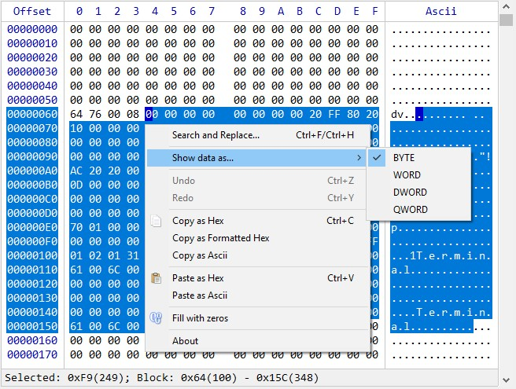
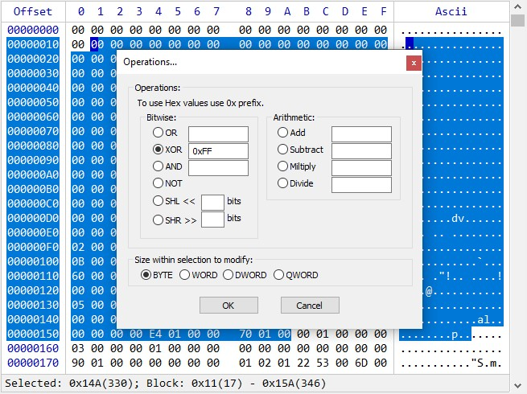
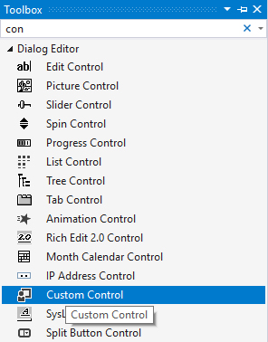

## **Hex Control, C++/MFC**

## Table of Contents
* [Introduction](#introduction)
* [Installation](#installation)
  * [Building From The Sources](#building-from-the-sources)
  * [Dynamic Link Library](#dynamic-link-library)
  * [IHexCtrlPtr](#ihexctrlptr)
  * [Namespace](#namespace)
* [Creating](#creating)
  * [Classic Approach](#classic-approach)
  * [In Dialog](#in-dialog)
* [Set The Data](#set-the-data)
* [Data Modes](#data-modes)
  * [Memory Data](#memory-data)
  * [Message Window](#message-window)
  * [Virtual Handler](#virtual-handler)
* [Virtual Bookmarks](#virtual-bookmarks)
* [Methods](#methods) <details><summary>_Expand_</summary>
  * [AddBookmark](#addbookmark)
  * [ClearData](#cleardata)
  * [Create](#create)
  * [CreateDialogCtrl](#createdialogctrl)
  * [Destroy](#destroy)
  * [GetCapacity](#getcapacity)
  * [GetColor](#getcolor)
  * [GetFontSize](#getfontsize)
  * [GetMenuHandle](#getmenuhandle)
  * [GetSelection](#getselection)
  * [GetShowMode](#getshowmode)
  * [GetWindowHandle](#getwindowhandle)
  * [GoToOffset](#gotooffset) 
  * [IsCreated](#iscreated)
  * [IsDataSet](#isdataset)
  * [IsMutable](#ismutable)
  * [RemoveBookmark](#removebookmark)
  * [SetCapacity](#setcapacity)
  * [SetColor](#setcolor)
  * [SetData](#setdata)
  * [SetFont](#setfont)
  * [SetFontSize](#setfontsize)
  * [SetMutable](#setmutable)
  * [SetSectorSize](#setsectorsize)
  * [SetSelection](#setselection)
  * [SetShowMode](#setshowmode)
  * [SetWheelRatio](#setwheelratio)
   </details>
* [Structures](#structures) <details><summary>_Expand_</summary>
  * [HEXCREATESTRUCT](#hexcreatestruct)
  * [HEXCOLORSTRUCT](#hexcolorstruct)
  * [HEXDATASTRUCT](#hexdatastruct)
  * [HEXSPANSTRUCT](#hexspanstruct)
  * [HEXBOOKMARKSTRUCT](#hexbookmarkstruct)
  * [HEXMODIFYSTRUCT](#hexmodifystruct)
  * [HEXNOTIFYSTRUCT](#hexnotifystruct)
  * [EHexCreateMode](#ehexcreatemode)
  * [EHexShowMode](#ehexshowmode)
  * [EHexDataMode](#ehexdatamode)
  * [EHexModifyMode](#ehexmodifymode)
  * [EHexOperMode](#ehexopermode)
   </details>
* [Notification Messages](#notification-messages) <details><summary>_Expand_</summary>
  * [HEXCTRL_MSG_CARETCHANGE](#hexctrl_msg_caretchange)
  * [HEXCTRL_MSG_CONTEXTMENU](#hexctrl_msg_contextmenu)
  * [HEXCTRL_MSG_DATACHANGE](#hexctrl_msg_datachange)
  * [HEXCTRL_MSG_DESTROY](#hexctrl_msg_destroy)
  * [HEXCTRL_MSG_GETDATA](#hexctrl_msg_getdata)
  * [HEXCTRL_MSG_MENUCLICK](#hexctrl_msg_menuclick)
  * [HEXCTRL_MSG_SELECTION](#hexctrl_msg_selection)
  * [HEXCTRL_MSG_VIEWCHANGE](#hexctrl_msg_viewchange)
   </details>
* [Exported Functions](#exported-functions) <details><summary>_Expand_</summary>
  * [CreateRawHexCtrl](#createrawhexctrl)
  * [GetHexCtrlInfo](#gethexctrlinfo)
  * [HEXCTRLINFO](#hexctrlinfo)
   </details>
* [Positioning and Sizing](#positioning-and-sizing)
* [Appearance](#appearance)
* [Licensing](#licensing)

## [](#)Introduction
Being good low level library on top of Windows API in general, **MFC** was always lacking a good native controls support. This **HexControl** is an attempt to expand standard **MFC** functionality, because at the moment **MFC** doesn't provide support for such control.

This doesn't mean that **HexControl** is limited to use only in **MFC** environment. The control is implemented as a pure abstract interface, and can be used as a *child* or *popup* window in any place of your application.  
It is written and tested with **/std:c++17** in *Visual Studio 2019*, under the *Windows 10*.

### The main features of the **HexControl**:
* View and edit data up to **16EB** (exabyte)
* Work in three different data modes: **Memory**, **Message**, **Virtual**.
* Fully featured **Bookmarks manager**
* **Search and Replace...** for Hex, Ascii, UTF-16
* Many options to **Copy/Paste** to/from clipboard
* **Undo/Redo**
* Modify data with **Filling** and many predefined **Operations** options
* Ability to divide data into visual [Sectors](#setsectorsize)
* Cutomizable look and appearance
* Written with **/std:c++17** standard conformance



## [](#)Installation
The **HexControl** can be used in two different ways:  
* Building from the sources as a part of your project 
* Using as a *.dll*.

### [](#)Building From The Sources
The building process is quite simple:
1. Copy *HexCtrl* folder and its content (except **.vcxproj* files) into your project's folder.
2. Add all files from that *HexCtrl* folder into your project.
3. Add `#include "HexCtrl/HexCtrl.h"` where you suppose to use the control.
4. Declare [`IHexCtrlPtr`](#ihexctrlptr) member variable: `IHexCtrlPtr myHex { CreateHexCtrl() };`
5. [Create](#creating) control instance.

If you want to build **HexControl** from the sources in non **MFC** app you will have to:
1. Add support for **Use MFC in a Shared DLL** in your project settings.
2. Uncomment the line `//#define HEXCTRL_MANUAL_MFC_INIT` in `HexCtrl.h` header file.

### [](#)Dynamic Link Library
To use **HexControl** as the *.dll* do the following:
1. Copy *HexCtrl.h* file into your project's folder.
2. Copy *HexCtrl.lib* file into your project's folder, so that linker can see it.
3. Put *HexCtrl.dll* file next to your *.exe* file.
4. Add the following line where you suppose to use the control:
```cpp
#define HEXCTRL_SHARED_DLL //You can alternatively uncomment this line in HexCtrl.h.
#include "HexCtrl.h"` 
```
5. Declare [`IHexCtrlPtr`](#ihexctrlptr) member variable: `IHexCtrlPtr myHex { CreateHexCtrl() };`
5. [Create](#creating) control instance.

To get *HexCtrl.dll* and *HexCtrl.lib* files you can either download it from the [official repository](https://github.com/jovibor/HexCtrl/releases/latest) or build it yourself from the *HexCtrl/HexCtrl.vcxproj* **Visual Studio** project file.

**HexControl**'s *.dll* is built with **MFC** static linking, so even if you are to use it in your own **MFC** project, even with different **MFC** version, there should not be any interferences.

### [](#)IHexCtrlPtr
`IHexCtrlPtr` is, in fact, a pointer to a `IHexCtrl` pure abstract base class, wrapped either in `std::unique_ptr` or `std::shared_ptr`. You can choose whatever is best for your needs by comment/uncomment one of these alliases in *HexCtrl.h*:
```cpp
//using IHexCtrlPtr = IHexCtrlUnPtr;
using IHexCtrlPtr = IHexCtrlShPtr;
```

This wrapper is used mainly for convenience, so you don't have to bother about object lifetime, it will be destroyed automatically.
That's why there is a call to the factory function `CreateHexCtrl()` - to properly initialize a pointer.

If you, for some reason, need a raw interface pointer, you can directly call [`CreateRawHexCtrl`](#createrawhexctrl) function, which returns `IHexCtrl` interface pointer, but in this case you will need to call [`Destroy`](#destroy) method manually afterwards, to destroy `IHexCtrl` object.

### [](#)Namespace
**HexControl** uses its own namespace `HEXCTRL`.  
So it's up to you, whether to use namespace prefix before declarations:
```cpp
HEXCTRL::
```
or to define namespace globally, in the source file's beginning:
```cpp
using namespace HEXCTRL;
```

## [](#)Creating

### [](#)Classic Approach
[`Create`](#create) is the first method you call to create **HexControl** instance. It takes [`HEXCREATESTRUCT`](#hexcreatestruct) reference as an argument.

You can choose whether control will behave as *child* or independent *popup* window, by setting `enCreateMode` member of this struct to [`EHexCreateMode::CREATE_CHILD`](#ehexcreatemode) or [`EHexCreateMode::CREATE_POPUP`](#ehexcreatemode) accordingly.
```cpp
HEXCREATESTRUCT hcs;
hcs.enCreateMode = EHexCreateMode::CREATE_POPUP;
hcs.hwndParent = m_hWnd;
m_myHex->Create(hcs);
```
For all available options see [`HEXCREATESTRUCT`](#hexcreatestruct) description.

### [](#)In Dialog
To use **HexControl** within *Dialog* you can, of course, create it with the [Classic Approach](#classic-approach), call [`Create`](#create) method and provide all the necessary information.

But there is another option you can use:
1. Put **Custom Control** control from the **Toolbox** in **Visual Studio** dialog designer into your dialog template and make it desirable size.  
 
2. Go to the **Properties** of that control, and in the **Class** field, within the **Misc** section, type: <kbd>HexCtrl</kbd>.  
Give the control appropriate **ID** of your choise (<kbd>IDC_MY_HEX</kbd> in this example).  
Also, here you can set the control's **Dynamic Layout** properties, so that control behaves appropriately when dialog is being resized.  

3. Declare [`IHexCtrlPtr`](#ihexctrlptr) member varable within your dialog class:
```cpp
IHexCtrlPtr m_myHex { CreateHexCtrl() };
```
4. Call [`CreateDialogCtrl`](#createdialogctrl ) method from your dialog's `OnInitDialog` method.
```cpp
BOOL CMyDialog::OnInitDialog()
{
    CDialogEx::OnInitDialog();
    
    m_myHex->CreateDialogCtrl(IDC_MY_HEX, m_hWnd);
}
```

## [](#)Set the Data
To set a data to display in the **HexControl** use [`SetData`](#setdata) method.
The code below shows how to construct [`IHexCtrlPtr`](#ihexctrlptr) object and display first `0x1FF` bytes of the current app's memory:
```cpp
IHexCtrlPtr myHex { CreateHexCtrl() };

HEXCREATESTRUCT hcs;
hcs.hwndParent = m_hWnd;
hcs.rect = {0, 0, 600, 400}; //Window rect.

myHex->Create(hcs);

HEXDATASTRUCT hds;
hds.pData = (unsigned char*)GetModuleHandle(0);
hds.ullDataSize = 0x1FF;

myHex->SetData(hds);
```
The next example displays `std::string`'s text as hex:
```cpp
std::string str = "My string";
HEXDATASTRUCT hds;
hds.pData = (unsigned char*)str.data();
hds.ullDataSize = str.size();

myHex->SetData(hds);
```

## [](#)Data Modes
Besides the standard classical mode, when **HexControl** just holds a pointer to some array of bytes in memory, it also has additional advanced modes it can be running in.  
Theese modes can be quite useful for instance in cases where you need to display a very large amount of data that can't fit in memory all at once.

These modes are ruled over through the [`enDataMode`](#ehexdatamode) member of [`HEXDATASTRUCT`](#hexdatastruct).

### [](#)Memory Data
It's the default data mode the control works in.  
The [`enDataMode`](#ehexdatamode) member of the [`HEXDATASTRUCT`](#hexdatastruct) is set to `DATA_MEMORY`, and `pData` just points to bytes in memory.

### [](#)Message Window
If [`enDataMode`](#ehexdatamode) member of [`HEXDATASTRUCT`](#hexdatastruct) is set to `DATA_MSG`, the control works in so called **Message Window mode**.

What it means is that when control is about to display next byte, it will first ask for this byte from the [`HEXDATASTRUCT::hwndMsg`](#hexdatastruct) window, in the form of **[WM_NOTIFY](https://docs.microsoft.com/en-us/windows/win32/controls/wm-notify)** Windows' message. This is pretty much the same as the standard **MFC List Control** works when created with `LVS_OWNERDATA` flag.  
By default the [`HEXDATASTRUCT::hwndMsg`](#hexdatastruct) is equal to the control's parent window.

To properly handle this mode, you must process `WM_NOTIFY` messages in `hwndMsg` window as follows:
```cpp
BOOL CMyWnd::OnNotify(WPARAM wParam, LPARAM lParam, LRESULT* pResult)
{
    PHEXNOTIFYSTRUCT pHexNtfy = (PHEXNOTIFYSTRUCT)lParam;
    if (pHexNtfy->hdr.idFrom == IDC_MY_HEX)
    {
        switch (pHexNtfy->hdr.code)
        {
        case HEXCTRL_MSG_GETDATA:
            pHexNtfy->pData =  /*Code to set the pointer to an actual data*/;
            break;
        }
   }
}
```
`lParam` will hold a pointer to the [`HEXNOTIFYSTRUCT`](#hexnotifystruct) structure.

The first member of this structure is a standard Windows' **[NMHDR](https://docs.microsoft.com/en-us/windows/win32/api/richedit/ns-richedit-nmhdr)** struct, it will have its `code` member equal to `HEXCTRL_MSG_GETDATA`, indicating that **HexControl**'s byte request has arrived.  
The `ullIndex` member of the structure is an index of the byte to be displayed. And the `pData` is the pointer to an actual byte that you have to set in response.

### [](#)Virtual Handler
If [`enDataMode`](#ehexdatamode) member of [`HEXDATASTRUCT`](#hexdatastruct) is set to `DATA_VIRTUAL` then all the data routine will be done through `HEXDATASTRUCT::pHexVirtual` pointer.

This pointer is of `IHexVirtual` class type, which is a pure abstract base class.
You have to derive your own class from it and implement all its public methods:
```cpp
class IHexVirtual
{
public:
    virtual BYTE GetByte(ULONGLONG ullIndex) = 0;            //Gets the byte data by index.
    virtual void ModifyData(const HEXMODIFYSTRUCT& hmd) = 0; //Main routine to modify data, in fMutable=true mode.
};
```
Then provide a pointer to created object of this derived class prior to call to [`SetData`](#setdata) method in form of `HEXDATASTRUCT::pHexVirtual = &yourDerivedObject`.

## [](#)Virtual Bookmarks
**HexControl** has innate functional to work with any amount of bookmarked regions. These regions can be assigned with individual background and text color, and description.

But if you have some big and complicated data logic and want to handle all these regions yourself, you can do it.  
For this you have to inherit your own class from the `IHexBkmVirtual` pure virtual interface and implement all the routines withing this class.
You will have to assign then `pHexBkmVirtual` member of [`HEXDATASTRUCT`](#hexdatastruct) to instance of your class prior to [`SetData`](#setdata) call.  

The main method of the `IHexBkmVirtual` interface is `HitTest`. It takes byte's offset and returns pointer to [`HEXBOOKMARKSTRUCT`](#hexbookmarkstruct) if there is a bookmark withing this byte, or `nullptr` otherwise.

```cpp
class IHexBkmVirtual
{
    public:
    virtual DWORD Add(const HEXBOOKMARKSTRUCT& stBookmark) = 0; //Add new bookmark, return new bookmark's ID.
    virtual void ClearAll() = 0;                    //Clear all bookmarks.
    virtual auto GetNext()->HEXBOOKMARKSTRUCT* = 0; //Get next bookmark.
    virtual auto GetPrev()->HEXBOOKMARKSTRUCT* = 0; //Get previous bookmark.
    virtual bool HasBookmarks() = 0;                //Returns true is there is at least one bookmark atm.
    virtual auto HitTest(ULONGLONG ullOffset)->HEXBOOKMARKSTRUCT* = 0; //Has given offset the bookmark?
    virtual void Remove(ULONGLONG ullOffset) = 0;   //Remove bookmark by the given offset.
    virtual void RemoveId(DWORD dwId) = 0;          //Remove bookmark by given ID (returned by Add()).
};
```

## [](#)Methods
The **HexControl** has plenty of methods that you can use to customize its appearance, and to manage its behaviour.

### [](#)AddBookmark
```cpp
DWORD AddBookmark(const HEXBOOKMARKSTRUCT& hbs)
```
Adds new bookmark to the control. Uses [`HEXBOOKMARKSTRUCT`](#hexbookmarkstruct) as an argument. Returns created bookmark's id.
#### Example
```cpp
HEXBOOKMARKSTRUCT hbs;
hbs.vecSpan.emplace_back(HEXSPANSTRUCT { 0x1, 10 });
hbs.clrBk = RGB(0, 255, 0);
hbs.clrText = RGB(255, 255, 255);
hbs.wstrDesc = L"My first bookmark, with green bk and white text.";

myHex.AddBookmark(hbs);
```

### [](#)ClearData
```cpp
void ClearData();
```
Clears data from the **HexControl** view, not touching data itself.

### [](#)Create
```cpp
bool Create(const HEXCREATESTRUCT& hcs);
```
Main initialization method.  
Takes [`HEXCREATESTRUCT`](#hexcreatestruct) as argument. Returns `true` if created successfully, `false` otherwise.

### [](#)CreateDialogCtrl
```cpp
bool CreateDialogCtrl(UINT uCtrlID, HWND hwndDlg);
```
Creates **HexControl** from **Custom Control** dialog's template. Takes control's **id**, and dialog's window **handle** as arguments. See **[Creating](#in-dialog)** section for more info.

### [](#)Destroy
```cpp
void Destroy();
```
Destroys the control.  
You only invoke this method if you use a raw `IHexCtrl` pointer obtained by the call to `CreateRawHexCtrl` function. Otherwise don't use it.

**Remarks**  
You usually don't need to call this method unless you use **HexControl** through the raw pointer obtained by [`CreateRawHexCtrl`](#createrawhexctrl) factory function.  
If you use **HexControl** in standard way, through the [`IHexCtrlPtr`](#ihexctrlptr) pointer, obtained by `CreateHexCtrl` function, this method will be called automatically.

### [](#)GetCapacity
```cpp
DWORD GetCapacity()const
```
Returns current capacity.

### [](#)GetColor
```cpp
auto GetColor()const->HEXCOLORSTRUCT
```
Returns current [`HEXCOLORSTRUCT`](#hexcolorstruct).

### [](#)GetFontSize
```cpp
long GetFontSize()const;
```
Returns current font size.

### [](#)GetMenuHandle
```cpp
HMENU GetMenuHandle()const;
```
Retrives the `HMENU` handle of the control's context menu. You can use this handle to customize menu for your needs.

Control's internal menu uses menu `ID`s in range starting from `0x8001`. So if you wish to add your own new menu, assign menu `ID` starting from `0x9000` to not interfere.

When user clicks custom menu, control sends `WM_NOTIFY` message to its parent window with `LPARAM` pointing to [`HEXNOTIFYSTRUCT`](#hexnotifystruct) with its `hdr.code` member set to `HEXCTRL_MSG_MENUCLICK`. `ullData` field of the [`HEXNOTIFYSTRUCT`](#hexnotifystruct) will be holding `ID` of the menu clicked.

### [](#)GetSelection
```cpp
auto GetSelection()const->std::vector<HEXSPANSTRUCT>&;
```
Returns `std::vector` of offsets and sizes of the current selection.

### [](#)GetShowMode
```cpp
auto GetShowMode()const->EHexShowMode;
```
Retrieves current data show mode.

### [](#)GetWindowHandle
```cpp
HWND GetWindowHandle()const
```
Retrieves control's window handle.

### [](#)GoToOffset
```cpp
void GoToOffset(ULONGLONG ullOffset, bool fSelect, ULONGLONG ullSize)
```
Jumps to the `ullOffset` offset, and selects `ullSize` bytes if `fSelect` is `true`.

### [](#)IsCreated
```cpp
bool IsCreated()const;
```
Shows whether **HexControl** is created or not yet.

### [](#)IsDataSet
```cpp
bool IsDataSet()const;
```
Shows whether a data was set to **HexControl** or not

### [](#)IsMutable
```cpp
bool IsMutable()const;
```
Shows whether **HexControl** is currently in edit mode or not.

### [](#)RemoveBookmark
```cpp
void RemoveBookmark(DWORD dwId);
```
Removes bookmark by the given Id.

### [](#)SetCapacity
```cpp
void SetCapacity(DWORD dwCapacity);
```
Sets the **HexControl** current capacity.

### [](#)SetColor
```cpp
void SetColor(const HEXCOLORSTRUCT& clr);
```
Sets all the colors for the control. Takes [`HEXCOLORSTRUCT`](#hexcolorstruct) as the argument.

### [](#)SetData
```cpp
void SetData(const HEXDATASTRUCT& hds);
```
Main method to set data to display in read-only or edit modes. Takes [`HEXDATASTRUCT`](#hexdatastruct) as an  argument.

### [](#)SetFont
```cpp
void SetFont(const LOGFONTW* pLogFontNew);
```
Sets a new font for the **HexControl**. This font has to be monospaced.

### [](#)SetFontSize
```cpp
void SetFontSize(UINT uiSize);
```
Sets a new font size to the **HexControl**.

### [](#)SetMutable
```cpp
void SetMutable(bool fEnable);
```
Enables or disables mutable mode. In mutable mode all the data can be modified.

### [](#)SetSectorSize
```cpp
void SetSectorSize(DWORD dwSize, const wchar_t* wstrName = L"Sector");
```
Sets the size of the sector to draw the divider line between. This size should be multiple to the current [capacity](#setcapacity) size to take effect. The second argument sets the name to be displayed in the bottom info area of the **HexControl** ("Sector", "Page", "etc...").  
To remove the divider just set `dwSize` to 0.

### [](#)SetSelection
```cpp
void SetSelection(ULONGLONG ullOffset, ULONGLONG ullSize)
```
Sets current selection.

### [](#)SetShowMode
```cpp
void SetShowMode(EHexShowMode enShowMode);
```
Sets current data show mode. See [`EHexShowMode`](#ehexshowmode) for more info.

### [](#)SetWheelRatio
```cpp
void SetWheelRatio(double dbRatio)
```
Sets the ratio for how much to scroll with mouse-wheel.

## [](#)Structures
Below are listed all **HexControl**'s structures.

### [](#)HEXCREATESTRUCT
The main initialization struct used for control creation.
```cpp
struct HEXCREATESTRUCT
{
    EHexCreateMode  enCreateMode { EHexCreateMode::CREATE_CHILD }; //Creation mode of the HexCtrl window.
    EHexShowMode    enShowMode { EHexShowMode::ASBYTE };           //Data representation mode.
    HEXCOLORSTRUCT  stColor { };          //All the control's colors.
    HWND            hwndParent { };       //Parent window pointer.
    const LOGFONTW* pLogFont { };         //Font to be used, nullptr for default. This font has to be monospaced.
    RECT            rect { };             //Initial rect. If null, the window is screen centered.
    UINT            uID { };              //Control ID.
    DWORD           dwStyle { };          //Window styles, 0 for default.
    DWORD           dwExStyle { };        //Extended window styles, 0 for default.
    double          dbWheelRatio { 1.0 }; //Ratio for how much to scroll with mouse-wheel.
};
```

### [](#)HEXCOLORSTRUCT
This structure describes all control's colors. All theese colors have their default values.
```cpp
struct HEXCOLORSTRUCT
{
    COLORREF clrTextHex { GetSysColor(COLOR_WINDOWTEXT) };         //Hex chunks text color.
    COLORREF clrTextAscii { GetSysColor(COLOR_WINDOWTEXT) };       //Ascii text color.
    COLORREF clrTextSelected { GetSysColor(COLOR_HIGHLIGHTTEXT) }; //Selected text color.
    COLORREF clrTextCaption { RGB(0, 0, 180) };                    //Caption text color
    COLORREF clrTextInfoRect { GetSysColor(COLOR_WINDOWTEXT) };    //Text color of the bottom "Info" rect.
    COLORREF clrTextCursor { RGB(255, 255, 255) };                 //Cursor text color.
    COLORREF clrTextTooltip { GetSysColor(COLOR_INFOTEXT) };       //Tooltip text color.
    COLORREF clrBk { GetSysColor(COLOR_WINDOW) };                  //Background color.
    COLORREF clrBkSelected { GetSysColor(COLOR_HIGHLIGHT) };       //Background color of the selected Hex/Ascii.
    COLORREF clrBkInfoRect { GetSysColor(COLOR_BTNFACE) };         //Background color of the bottom "Info" rect.
    COLORREF clrBkCursor { RGB(0, 0, 255) };                       //Cursor background color.
    COLORREF clrBkCursorSelected { RGB(0, 0, 200) };               //Cursor background color in selection.
    COLORREF clrBkTooltip { GetSysColor(COLOR_INFOBK) };           //Tooltip text color.
};
```

### [](#)HEXDATASTRUCT
Main struct to set a data to display in the control.
```cpp
struct HEXDATASTRUCT
{
    EHexDataMode    enDataMode { EHexDataMode::DATA_MEMORY }; //Working data mode.
    ULONGLONG       ullDataSize { };                       //Size of the data to display, in bytes.
    HEXSPANSTRUCT   stSelSpan { };                         //Select .ullOffset initial position. Works only if .ullSize > 0.
    HWND            hwndMsg { };                           //Window for DATA_MSG mode. Parent is used by default.
    IHexVirtual*    pHexVirtual { };                       //Pointer for DATA_VIRTUAL mode.
    IHexBkmVirtual* pHexBkmVirtual { };                    //Pointer for Virtual Bookmarks.
    PBYTE           pData { };                             //Data pointer for DATA_MEMORY mode. Not used in other modes.
    bool            fMutable { false };                    //Is data mutable (editable) or read-only.
};
```

### [](#)HEXSPANSTRUCT
This struct is used mostly in selection and bookmarking routines. It holds offset and size of the data region.
```cpp
struct HEXSPANSTRUCT
{
    ULONGLONG ullOffset { };
    ULONGLONG ullSize { };
};
```

### [](#)HEXBOOKMARKSTRUCT
Structure for bookmarks, used in [`AddBookmark`](#addbookmark) method.  
```cpp
struct HEXBOOKMARKSTRUCT
{
    std::vector<HEXSPANSTRUCT> vecSpan { };                    //Vector of offsets and sizes.
    std::wstring               wstrDesc { };                   //Description text.
    COLORREF                   clrBk { RGB(240, 240, 0) };     //Bk color.
    COLORREF                   clrText { RGB(250, 250, 250) }; //Text color.
};
```
The member `vecSpan` being of a `std::vector` type is because a bookmark may have few non adjacent areas. For instance, when selection is made as a block, with <kbd>Alt</kbd> pressed.

### [](#)HEXMODIFYSTRUCT
This structure is used internally in [`DATA_MEMORY`](#ehexdatamode) mode, as well as in the external notification routines, when working in [`DATA_MSG`](#ehexdatamode) and [`DATA_VIRTUAL`](#ehexdatamode) modes.
```cpp
struct HEXMODIFYSTRUCT
{
    EHexModifyMode enModifyMode { EHexModifyMode::MODIFY_DEFAULT }; //Modify mode.
    EHexOperMode   enOperMode { };          //Operation mode enum. Used only if enModifyMode == MODIFY_OPERATION.
    const BYTE*    pData { };               //Pointer to a data to be set.
    ULONGLONG      ullDataSize { };         //Size of the data pData is pointing to.
    std::vector<HEXSPANSTRUCT> vecSpan { }; //Vector of data offsets and sizes.
};
```
When `enModifyMode` is set to [`EHexModifyMode::MODIFY_DEFAULT`](#ehexmodifymode), bytes from `pData` just replace corresponding data bytes as is.  

If `enModifyMode` is equal to [`EHexModifyMode::MODIFY_REPEAT`](#ehexmodifymode) then block by block replacement takes place few times.

For example: if `SUM(vecSpan.ullSize)` = 9, `ullDataSize` = 3 and `enModifyMode` is set to [`EHexModifyMode::MODIFY_REPEAT`](#ehexmodifymode), bytes in memory at `vecSpan.ullOffset` position are `123456789`, and bytes pointed to by `pData` are `345`, then, after modification, bytes at `vecSpan.ullOffset` will be `345345345`.

If `enModifyMode` is equal to [`EHexModifyMode::MODIFY_OPERATION`](#ehexmodifymode) then
[`enOperMode`](#ehexopermode) comes into play, showing what kind of operation must be performed on data.

### [](#)HEXNOTIFYSTRUCT
This struct is used in notification purposes, to notify parent window about **HexControl**'s states.
```cpp
struct HEXNOTIFYSTRUCT
{
    NMHDR         hdr { };     //Standard Windows header. For hdr.code values see HEXCTRL_MSG_* messages.
    HEXSPANSTRUCT stSpan { };  //Offset and size of the bytes. 
    ULONGLONG     ullData { }; //Data depending on message (e.g. user defined custom menu id/cursor pos).
    const BYTE*   pData { };   //Pointer to a data to get/send.
};
using PHEXNOTIFYSTRUCT = HEXNOTIFYSTRUCT*;
```

### [](#)EHexCreateMode
Enum that represents mode the **HexControl**'s window will be created in.
```cpp
enum class EHexCreateMode : DWORD
{
    CREATE_CHILD, CREATE_POPUP, CREATE_CUSTOMCTRL
};
```

### [](#)EHexShowMode
Enum that represents available data show modes.
```cpp
enum class EHexShowMode : DWORD
{
    ASBYTE = 1, ASWORD = 2, ASDWORD = 4, ASQWORD = 8
};
```

### [](#)EHexDataMode
`Enum` that represents current data [mode](#data-modes) **HexControl** works in. It's used as [`HEXDATASTRUCT`](#hexdatastruct) member in [`SetData`](#setdata) method.
```cpp
enum class EHexDataMode : DWORD
{
    DATA_MEMORY, DATA_MSG, DATA_VIRTUAL
};
```

### [](#)EHexModifyMode
Enum represents current data modification type.
```cpp
enum class EHexModifyMode : WORD
{
    MODIFY_DEFAULT, MODIFY_REPEAT, MODIFY_OPERATION
};
```

### [](#)EHexOperMode
Enum describes type of bitwise and arithmetic operations that should be performed on the data.
```cpp
enum class EHexOperMode : WORD
{
    OPER_OR = 0x01, OPER_XOR, OPER_AND, OPER_NOT, OPER_SHL, OPER_SHR,
    OPER_ADD, OPER_SUBTRACT, OPER_MULTIPLY, OPER_DIVIDE
};
```

## [](#)Notification Messages
In process of its work **HexControl** sends notification messages through **[WM_NOTIFY](https://docs.microsoft.com/en-us/windows/win32/controls/wm-notify)** mechanism to indicate its states. Theese messages are sent either to [`HEXCREATESTRUCT::hwndParent`](#hexcreatestruct) or to [`HEXDATASTRUCT::hwndMsg`](#hexdatastruct) window, depending on whether the latter is set.

### [](#)HEXCTRL_MSG_CARETCHANGE
Sent when caret position has changed. [`HEXNOTIFYSTRUCT::ullData`](#hexnotifystruct) will have current caret position.

### [](#)HEXCTRL_MSG_CONTEXTMENU
Sent when context menu is about to be displayed.

### [](#)HEXCTRL_MSG_DATACHANGE
Sent to indicate that the data has changed, used together with the pointer to [`HEXMODIFYSTRUCT`](#hexmodifystruct).

### [](#)HEXCTRL_MSG_DESTROY
Sent to indicate that **HexControl** window is about to be destroyed.

### [](#)HEXCTRL_MSG_GETDATA
Used in [`DATA_MSG`](#ehexdatamode) mode to acquire the next byte to display.

### [](#)HEXCTRL_MSG_MENUCLICK
Sent when user defined custom menu has been clicked.

### [](#)HEXCTRL_MSG_SELECTION
Sent when selection has been made.

### [](#)HEXCTRL_MSG_VIEWCHANGE
Sent when **HexControl**'s view has changed. [`HEXNOTIFYSTRUCT::ullData`](#hexnotifystruct) will have current top line number.

## [](#)Exported Functions
**HexControl** has few `"C"` interface functions which it exports when built as *.dll*.

### [](#)CreateRawHexCtrl
```cpp
extern "C" HEXCTRLAPI IHexCtrl* __cdecl CreateRawHexCtrl();
```
Main function that creates raw `IHexCtrl` interface pointer. You barely need to use this function in your code.  
See the [`IHexCtrlPtr`](#ihexctrlptr) section for more info.

### [](#)GetHexCtrlInfo
```cpp
extern "C" HEXCTRLAPI HEXCTRLINFO* __cdecl GetHexCtrlInfo();
```
Returns pointer to [`HEXCTRLINFO`](#hexctrlinfo), which is the **HexControl**'s service information structure.

### [](#)HEXCTRLINFO
Service structure, keeps **HexControl**'s version information.
```cpp
struct HEXCTRLINFO
{
    const wchar_t* pwszVersion { };        //WCHAR version string.
    union {
        unsigned long long ullVersion { }; //ULONGLONG version number.
        struct {
            short wMajor;
            short wMinor;
            short wMaintenance;
            short wRevision;
        }stVersion;
    };
};
```

## [](#)Positioning and Sizing
To properly resize and position your **HexControl**'s window you may have to handle `WM_SIZE` message in its parent window, in something like this way:
```cpp
void CMyWnd::OnSize(UINT nType, int cx, int cy)
{
    //...
    ::SetWindowPos(m_myHex->GetWindowHandle(), this->m_hWnd, 0, 0, cx, cy, SWP_NOACTIVATE | SWP_NOZORDER);
}
```

## [](#)Appearance
To change control's font size — <kbd>Ctrl+MouseWheel</kbd>  
To change control's capacity — <kbd>Ctrl+Shift+MouseWheel</kbd>

## [](#)Licensing
This software is available under the **"MIT License modified with The Commons Clause".**  
Briefly: It is free for any **non commercial** use.  
[https://github.com/jovibor/HexCtrl/blob/master/LICENSE](https://github.com/jovibor/HexCtrl/blob/master/LICENSE)